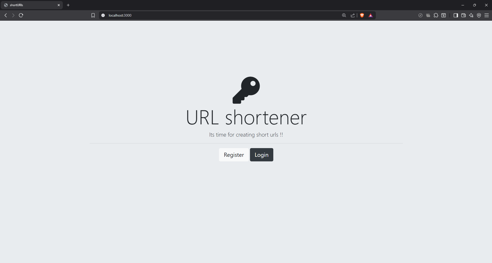
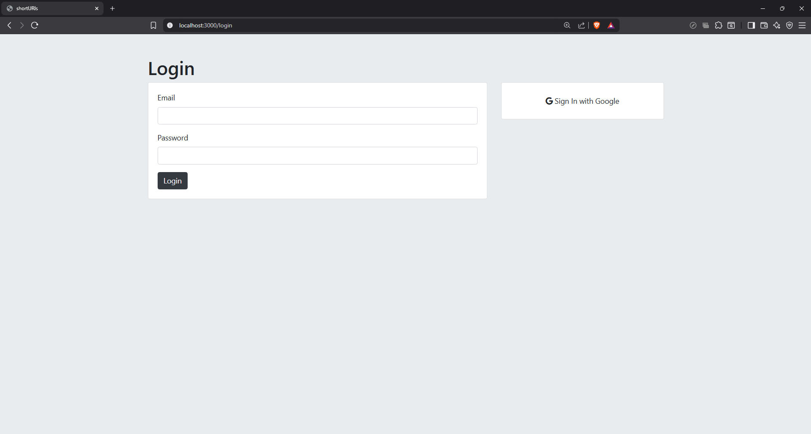
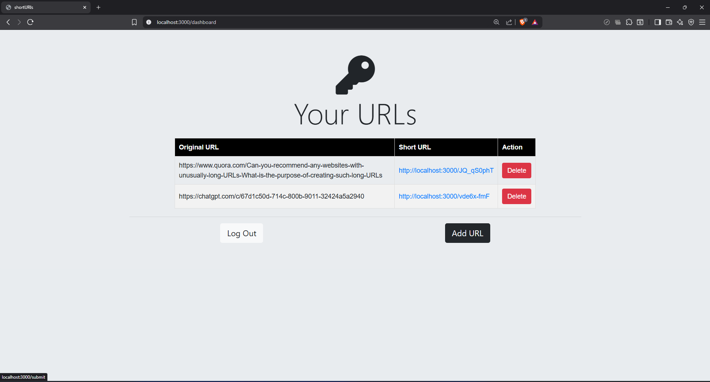
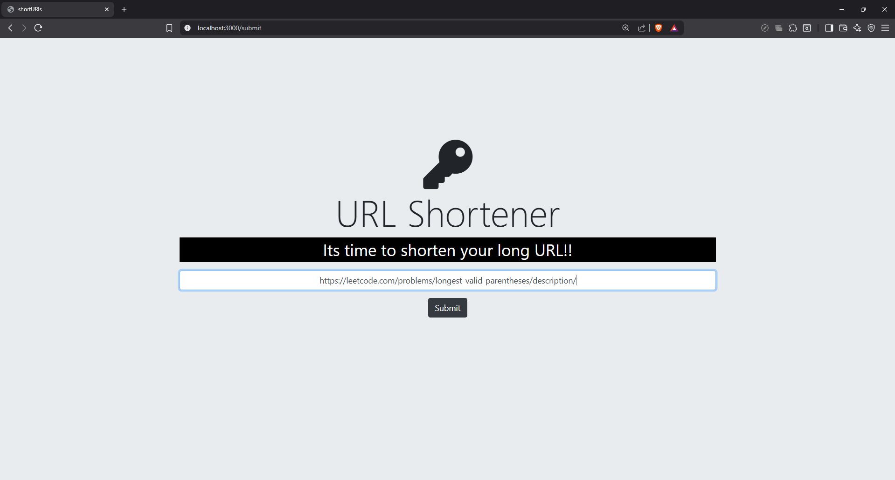

# 🔗 ShortURLS

A lightweight **URL Shortener** built with **Node.js** and **SQL**. This project allows users to shorten long URLs into compact short links and redirect them seamlessly to the original destination.  

🎯 **Goal**: Provide a simple, efficient, and extensible service to generate and manage short URLs.

---

## Features 🚀

- ✅ **URL Shortening** – Convert long URLs into short, shareable links  
- ✅ **Redirection** – Access the original site using the short URL  
- ✅ **Database Integration** – Store URL mappings with SQL  
- ✅ **Environment Config** – Secure setup using `.env` variables  
- ✅ **Scalable Design** – Modular and clean codebase for easy expansion  

---

## Tech Stack 🛠️

- **Language**: JavaScript (Node.js)  
- **Framework**: Express.js  
- **Database**: MySQL (or PostgreSQL)  
- **IDE**: VS Code  
- **Dependencies**: Listed in `package.json`  

---

## Project Structure 📁

```plaintext
shortURLS/
├── index.js        // Main server file
├── package.json    // Project dependencies & scripts
├── queries.sql     // Database schema & queries
├── .env            // Environment variables
└── README.md       // Project documentation
```
## How It Works 🔍

- The user submits a **long URL** through the application.  
- The backend generates a **unique short ID** and stores it along with the original URL in the database.  
- When a user visits the **shortened link**, the service retrieves the original URL using the short ID.  
- The user is then seamlessly **redirected to the original URL**.  
- The mapping remains stored in the database for future requests.  

 ## Project Preview 🖼️
 ### Home Page


### Login Page


### Dashboard

### Add URL


### Updated Dashboard

 ## Getting Started
 
### Prerequisites
- **Node.js** (v14 or above)  
- **MySQL/PostgreSQL** installed locally or hosted  
- **Git** (optional, for cloning the repository)  

---

### Installation ⚙️

- **Clone the Repository**
  ```bash
  git clone https://github.com/ChillyColor/shortURLS.git
  cd shortURLS
  ```
- **Install Dependecies**
   ```bash
  npm install
    ```
- **Setup Environment Variables(.env)**
  ```bash
  PORT=3000
  DB_HOST=localhost
  DB_USER=your_username
  DB_PASSWORD=your_password
  DB_NAME=shorturls
  ```
- **Run the Application**
  ```bash
  nodemon index.js
  ```
## Developed By 👨‍💻

**Aakarsh Divyam**  
GitHub: [@Aakarsh](https://github.com/ChillyColor)
